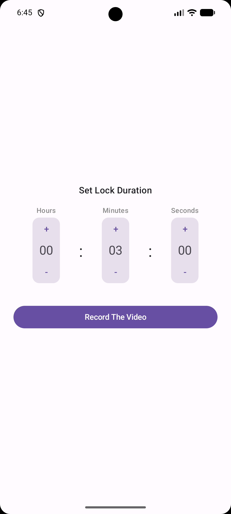
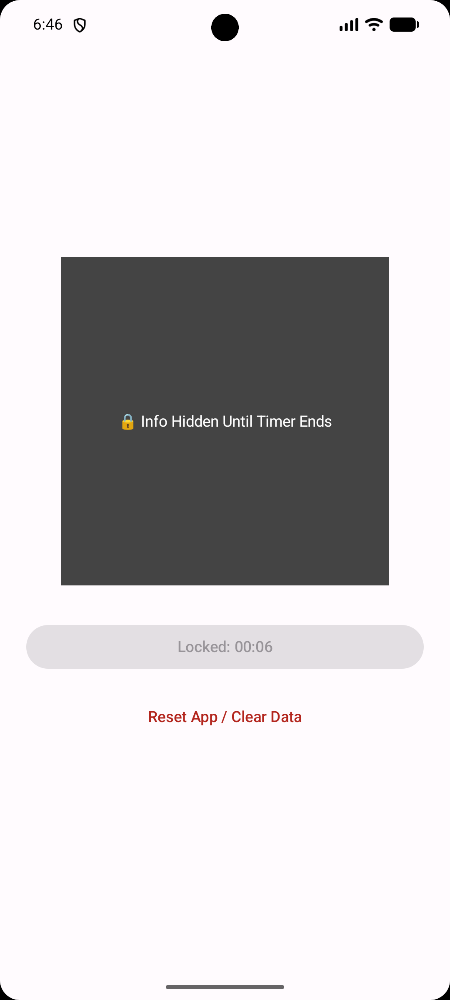
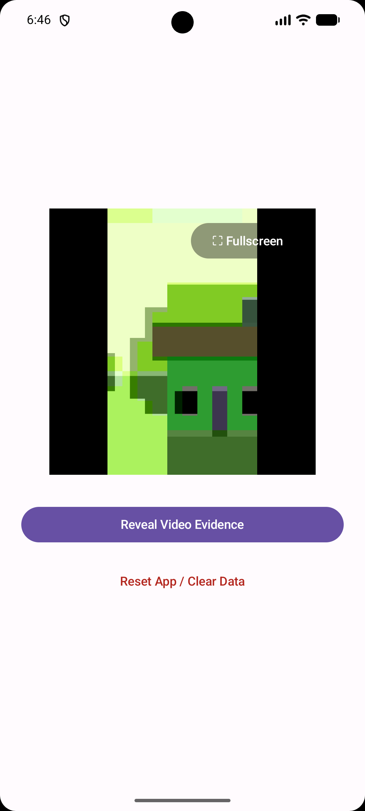
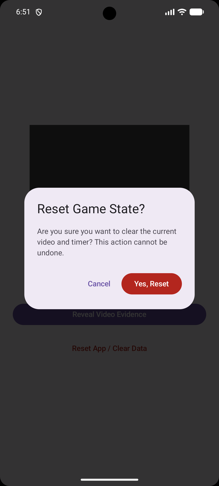

# Android timer lock

Android app that allows users to record a short video clip and lock it behind a secure countdown timer.

Could be useful to record a secret - like a lockbox combination - without looking at it and reveal it later after a preselected time,
while the timer is going the video cannot be viewed.

The app is also tamper-proof, changing the time on the Android, restarting the app / device or trying to find the videofile on the filesystem will not work.

Putting the app in the background or the app going to sleep will not interfere with the countdown, however restarting the phone resets the countdown timer to the originally set value.

## 📸 Screenshots

To give you a quick look at the application flow, here is the step-by-step usage:

| 1. Setup Time | 2. Take Video | 3. Countdown |
| :---: | :---: | :---: |
|  |  |  |
| Configure time | Take a video | Wait for countdown |

| 4. Reveal Video | 5. Reset |
| :---: | :---: |
|  |   |
| Reveal video | Reset once finished |

## 📦 Installation & Setup

Install using the apk from releases, or run or build this project locally using Android Studio.

## 🛠️ Tech Stack & Architecture

- **UI Framework:** Jetpack Compose (Kotlin)
- **Design System:** Material Design 3 (M3)
- **Video Engine:** AndroidX Media3 ExoPlayer & PlayerView
- **Storage:** Android Internal Storage Sandbox & SharedPreferences
- **Minimum SDK Version:** API 24 (Android 7.0)

